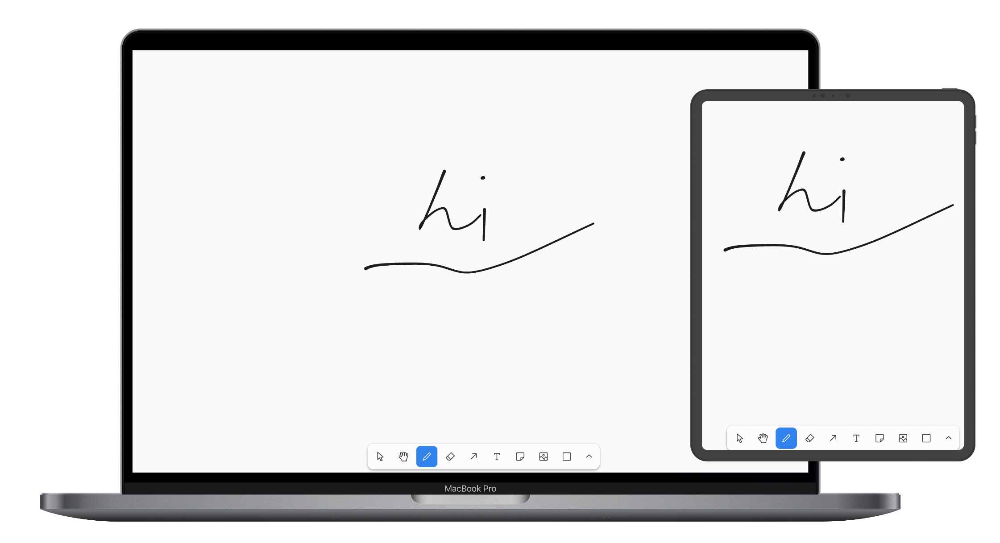

# demoboard

局域网临时白板演示



主机打开网页，平板连接网页白板演示，并同步到主机网页

## 快速开始

### docker 启动

```bash
docker run --rm -p 9527:9527 kamidalu/demoboard:latest
```

本机设备可以访问  http://localhost:9527/room/demo

其他局域网设备访问 http://\<host-ip\>:9527/room/demo


> 本机局域网 ip 可以通过如下命令获取
>
> ```bash
> ip route get 1.1.1.1 | awk '{print $7; exit}'
> 
> hostname -I | awk '{print $1}'
> ```


常见用法是平板通过浏览器访问网址画图，主机侧的网页也会自动同步

如需在后台运行

```bash
docker run -d --name demoboard -p 9527:9527 kamidalu/demoboard:latest
```

### 本地部署

安装依赖：

```bash
npm install
```

启动局域网服务：

```bash
npm run start:lan
```

主机浏览器访问：http://localhost:9527/room/demo

同一 WiFi / 局域网内的平板访问：http://\<host-ip\>:9527/room/demo

## 构建与生产启动

```bash
npm run build
npm start
```

## Docker

本地构建镜像：

```bash
docker build -t demoboard:latest .
```

启动容器：

```bash
docker run --rm -p 9527:9527 demoboard:latest
```

## 配置

可通过环境变量调整监听地址：

```bash
HOST=0.0.0.0 PORT=9527 npm run start:lan
```

## 说明

白板状态只保存在内存中。进程重启或最后一个客户端离开房间后，当前房间内容会被释放，没有 sqlite 等存储，仅用于临时演示场景。

白板演示功能使用 [tldraw sync sdk](https://tldraw.dev/) 构建